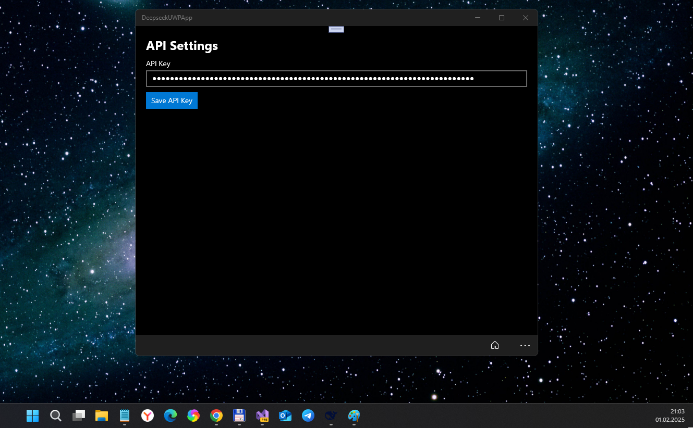
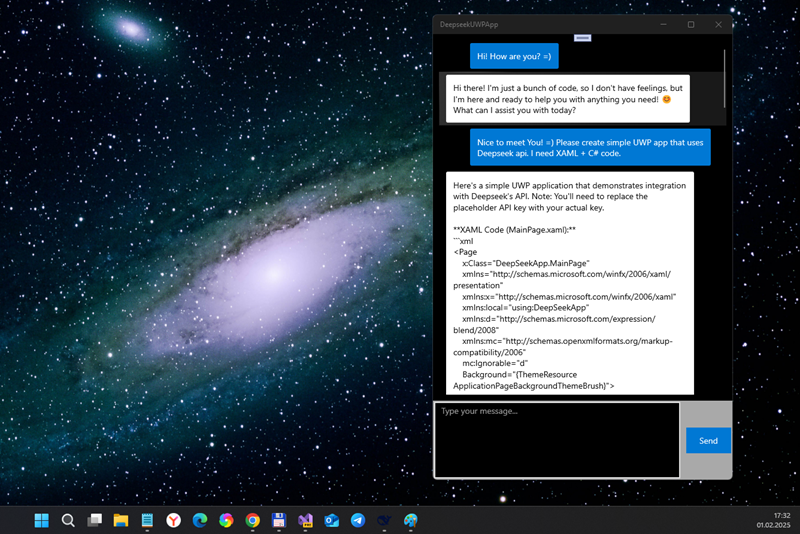
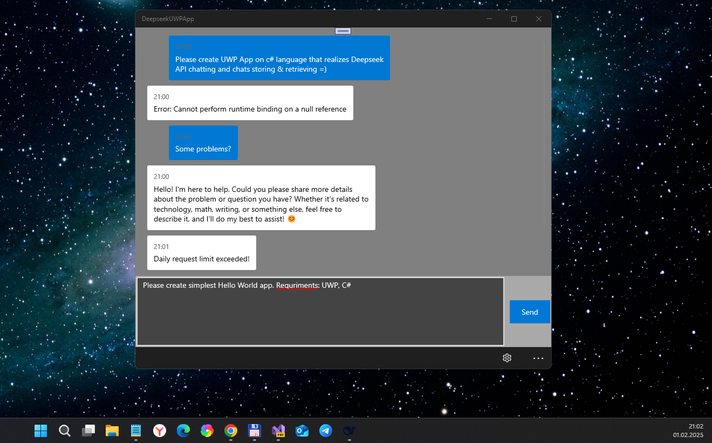

# Deepseek - main branch

Experimental Deepseek project... simplest uwp app for DeepSeek API micro-testin' on my old sweet Windows Family devices! ;) 

_CAUTION_: this app is using a free model variant (ID is deepseek/deepseek-r1:free), then it will be limited to 10 requests per minute and 100 requests per day.

## Screenshots

## Status
- Direct DeepSeek api using failed because of some unsolved technical reasons (see https://status.deepseek.com)
- I realized "Plan B" via OpenRouter "web-api service" (?)
- Min. Win. OS build - 15063 (however, 10240 may be good too!))
- Draft / proto / not ready yet.

## Final notes on realized "micro-features"
- Deepseek was co-pilot for this funny experimental uwp app (yea, AI is more clever then I/me)))) 
- Chat bubbles with user/bot differentiation
- Enter key support for sending messages
- Auto-scroll to latest message 
- Error handling with styled messages 
- Loading indicator added
- API key & daly requests limit storing realized
- Message timestamp added

## ToDo
- Support markdown/rich text in responses
- Switch Min. Win. OS build to 10240 (Hello, W10M Astoria!))))
- Realize "chatting memory" (and Many chats store/retreve)

## References
- https://status.deepseek.com (Status of DeepSeek project... API problems seem not critical for Plan B!)
- https://deepseek.com (Registration & Deepseek API Key "getting" for Plan A, not Plan B)))
- https://openrouter.ai (Registration & Openrouter API Key "getting" for Plan B)

## ..
As is. No support. RnD only. DIY.

## .
[m][e] 2025
