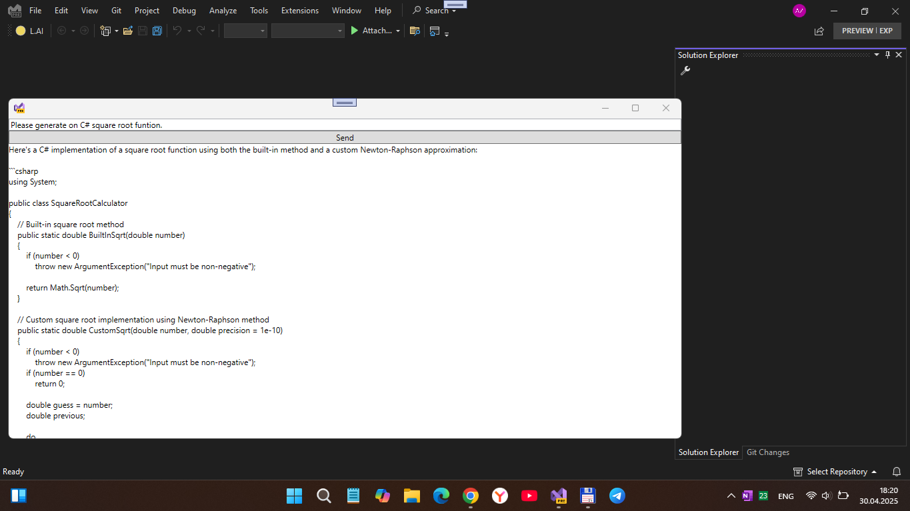

# Deepseek - vs-extension branch

Experimental OpenRouter-based extension for VS 2022... simplest window for short online-chat with Deepseek... 

_CAUTION_: this app is using a free model variant (ID is deepseek/deepseek-r1:free), then it will be limited to 10 requests per minute and 100 requests per day.

## Screenshot(s)

## Status
- "Almost emtpy" vs extension. Sunject to change
- Draft / proto / not ready /work in progress
- OpenRouter.AI API key needs to be hardcoded into "AIDialog.xaml.cs" (no settings yet!)

## ToDo
- Support markdown/rich text in responses
- Explore some mature VS Extension features (CodeSense, Code Output, etc.!)
- Fix Deepseek's null responses ("empty messages")

## ..
As is. No support. RnD only. DIY.

## .
[m][e] 2025
