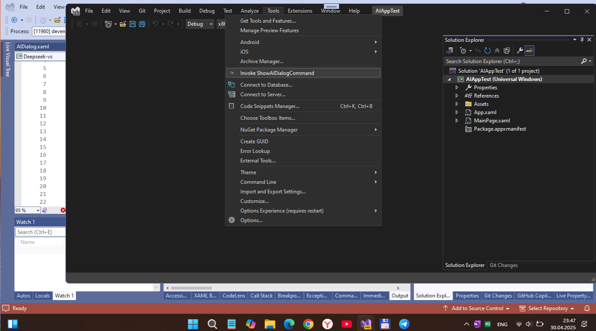
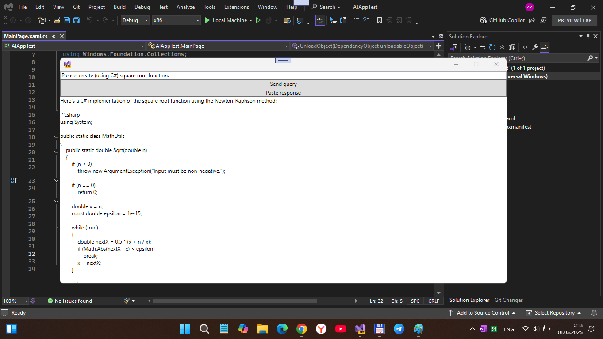
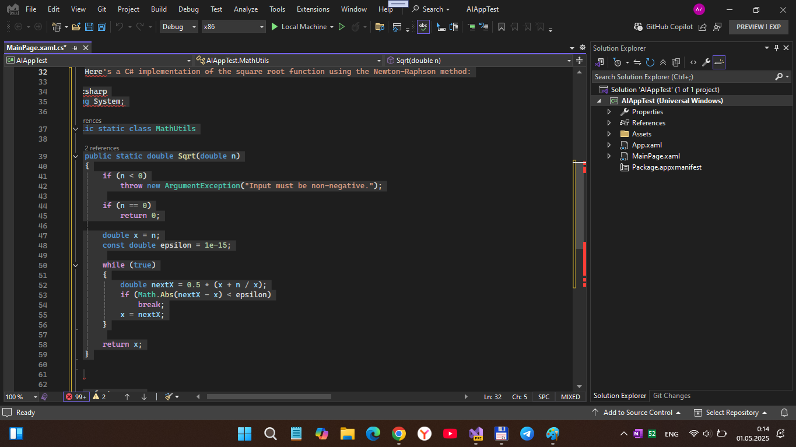

# Deepseek "VS Edition" v1.0.0  - vs-extension branch

Experimental OpenRouter-based extension for VS 2022... simplest window for short online-chat with Deepseek... 

_CAUTION_: this app is using a free model variant (ID is deepseek/deepseek-r1:free), then it will be limited to 10 requests per minute and 100 requests per day.

## Screenshot(s)

## Status
- "Almost emtpy" vs extension. Subject to change (codename is DeepseekVS)
- Draft / proto / not ready /work in progress
- OpenRouter.AI API key needs to be hardcoded into "AIDialog.xaml.cs" (no settings yet!)

# How-to use this extension
- Use Tools - Invoke ShowAIDialogCommand to open AI Assistant dialog window 
- ENter your query and press Send query button
- Wait some result 5-30 sec
- Paste response in/at main code editor area

## How to register your API key & use Deepseek-VS
- Go to [OpenRouter AI](https://openrouter.ai) site 
- Authorize via UserName/Password, or use your Google/GitHub account
- Create new Key and hardcode it into AIDialog.xaml.cs
- Build vsix and install it  

## ToDo
- Realize Option (Settings) to store APi key
- Support markdown/rich text in responses
- Explore some mature VS Extension features (CodeSense, Code Output, etc.!)
- Fix Deepseek's null responses ("empty messages")
- Extend options (Api endpoint, etc.)

## ..
As is. No support. RnD only. DIY.

## .
[m][e] 2025
