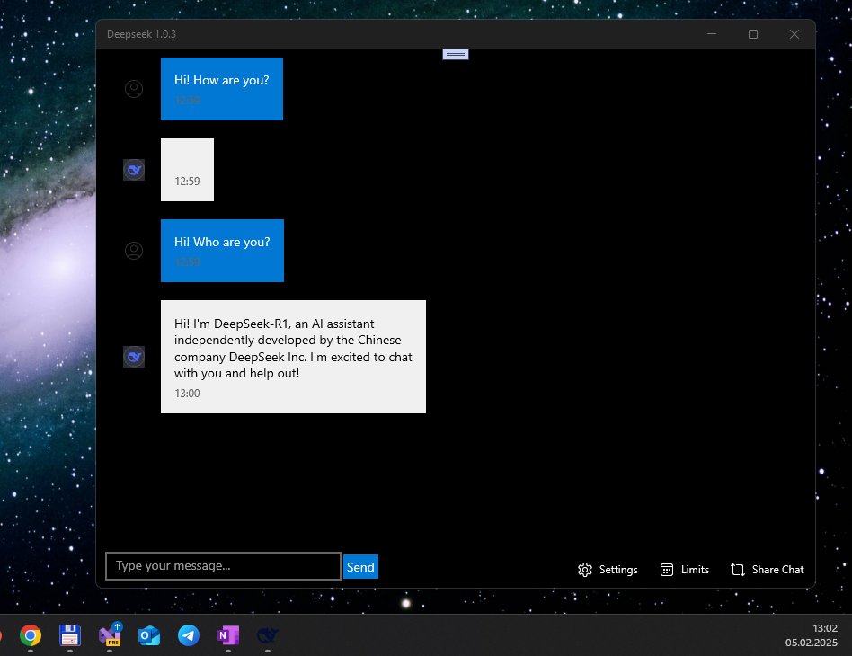

# Deepseek 1.0.3 - uwp branch

Experimental Deepseek project... simplest uwp app for DeepSeek API micro-testin' on my old sweet Windows Family devices! ;) 

_CAUTION_: this app is using a free model variant (ID is deepseek/deepseek-r1:free), then it will be limited to 10 requests per minute and 100 requests per day.

## Screenshot(s)

## Status
- Direct DeepSeek api using failed because of some unsolved technical reasons (see https://status.deepseek.com)
- I realized "Plan B" via OpenRouter "web-api service" (?)
- Min. Win. OS build - 15063 (however, 10240 may be good too!))
- Draft / proto / not ready yet.

## Final notes on realized "micro-features"
- Deepseek was co-pilot for this funny experimental uwp app (yea, AI is more clever then I/me)))) 
- Chat bubbles with user/bot differentiation
- Enter key + Tap Send key supported for sending messages
- Auto-scroll to latest message 
- Error handling with styled messages 
- Loading indicator added
- OpenRouter API key limits showing simplified
- Message timestamp added
- Chat conversation save/restore added
- Chat conversation Share added (single message - long tap/right click, and all messages via Share button)
- W10M 15063+ compatibility repaired!

## Known problems 
- Strange Share behavior: no message text ? (plan B -- message must be copied to clipboard, at least)))
- Deepseek can't remember previous posts (sometimes or all times… idk yet)
- Some Deepseek's answers are empty (damaged/failed?)

## ToDo
- Support markdown/rich text in responses
- Switch Min. Win. OS build to 10240 (Hello, W10M Astoria!)
- Fix Deepseek's null responses ("empty messages")

## Conclusion

I decided to share my dialogue with DeepSeek UI.. how to create Deepseek uwp app "template-prototype". 
So, look at Wiki: https://github.com/mediaexplorer74/Deepseek/wiki/

## References
- https://status.deepseek.com (Status of DeepSeek project... API problems seem not critical for Plan B!)
- https://deepseek.com (Registration & Deepseek API Key "getting" for Plan A, not Plan B)))
- https://openrouter.ai (Registration & Openrouter API Key "getting" for Plan B)

## ..
As is. No support. RnD only. DIY.

## .
[m][e] 2025
